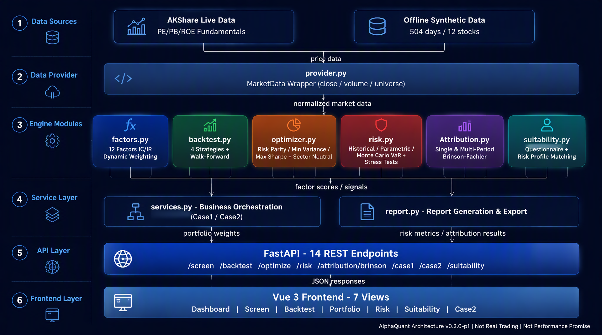

# AlphaQuant

基于因子增强与风险平价的智能资产配置平台（演示系统）。

面向 **2026 上海（长三角）中青年工程师创新创业大赛 · 金融科技赛道（黄浦承办）**。个人参赛，负责人冯亦根。

本仓库是 **FastAPI + Vue 3** 可运行产品，不是 Streamlit 换皮。当前为研发中的演示闭环：**不是实盘交易、不是真实持仓、不是收益承诺**。无需登录。

## 本地启动（Windows PowerShell）

端口：后端 **8010**，前端 **http://localhost:3000**。

### 一键（两个新窗口）

```powershell
cd <本仓库根目录>
.\scripts\dev.ps1
```

首次运行会 `pip install` 与 `npm install`。

### 分步

```powershell
python .\scripts\generate_offline_data.py
cd backend
pip install -r requirements.txt
$env:PYTHONPATH = (Get-Location).Path
python -m uvicorn app.main:app --host 127.0.0.1 --port 8010
```

另开窗口：`cd frontend; npm install; npm run dev`

浏览器打开 http://localhost:3000 。OpenAPI：http://127.0.0.1:8010/docs 。

### 冒烟

```powershell
python .\scripts\smoke_api.py
python .\scripts\robustness_api.py
```

前端验收：`cd frontend; npm run build`

## 主路径

- **案例 1**：仪表盘 **一键演示案例 1**（10 万元名义资金，样本内模拟）。
- **适当性**：**适当性**页问卷分档，与风险平价/仓位/波动匹配，可拦截；本地审计无证件号。
- **案例 2**：**案例2**页批量回测 + Brinson + 报告。1 亿元为**演示口径**，不是已管理实盘。

左侧可切「离线演示」或「自动（AKShare，失败则降级）」。断网请用离线。

更细的点击说明见 [docs/用户手册.md](docs/用户手册.md)。

## API

| 路径 | 说明 |
|------|------|
| `GET /health` | 存活 |
| `GET /api/screen` | 因子选股 + IC/IR + 衰减 |
| `GET /api/backtest` | 四策略回测 |
| `GET /api/optimize` | 四方法组合优化 |
| `GET /api/risk` | VaR/CVaR + 压力测试 |
| `GET /api/case1` | 案例 1 闭环 |
| `GET /api/suitability` | 问卷 + 样本匹配（`implemented: true`） |
| `POST /api/suitability/evaluate` | 提交问卷并匹配、写审计 |
| `GET /api/attribution/brinson` | Brinson 归因 |
| `GET /api/case2` | 案例 2 批量回测 + 归因 + 报告 |
| `POST /api/case2/export` | 导出 md/html 到 `data/reports/` |

查询参数 `source=offline|auto`。

## 系统架构



全链路：数据源（AKShare / 离线合成）→ provider.py 数据封装 → 六大引擎（factors / backtest / optimizer / risk / attribution / suitability）→ services.py + report.py 服务编排 → FastAPI 14 条 REST 端点 → Vue 3 前端 7 页面。

## 文档

- [docs/SCOPE.md](docs/SCOPE.md) 做/不做与禁语
- [docs/architecture-diagram-20260910201829162.png](docs/architecture-diagram-20260910201829162.png) 系统架构图
- [docs/contest-rules-notes.md](docs/contest-rules-notes.md) 初赛规则核对
- [docs/用户手册.md](docs/用户手册.md)
- [docs/demo-script.md](docs/demo-script.md)
- [docs/FAQ.md](docs/FAQ.md)
- [docs/bp/AlphaQuant-项目申报书.md](docs/bp/AlphaQuant-项目申报书.md)
- [docs/pitch/路演大纲.md](docs/pitch/路演大纲.md)
- 根目录 [demo.storyboard.json](demo.storyboard.json)
- [docs/demo-video.md](docs/demo-video.md) 与 [docs/demo/OBS录屏替代方案.md](docs/demo/OBS录屏替代方案.md)
- [docs/pitch/AlphaQuant-路演PPT-20260910.pptx](docs/pitch/AlphaQuant-路演PPT-20260910.pptx)
- [docs/bp/AlphaQuant-项目申报书-20260910.pdf](docs/bp/AlphaQuant-项目申报书-20260910.pdf)
- [docs/冲击冠军计划.md](docs/冲击冠军计划.md)
- 提交包 [delivery/00_README_交付总览.md](delivery/00_README_交付总览.md)
- [deploy/modelscope/GITHUB_ACTIONS.md](deploy/modelscope/GITHUB_ACTIONS.md) 魔搭 Docker 自动部署

## 公网 Demo（AlphaQuant）

- 体验：https://gsym236998-alphaquant.ms.show
- 创空间：https://www.modelscope.cn/studios/gsym236998/alphaquant
- 保活：`powershell -File scripts/keepalive.ps1`

QuantInsight / `quantinsight-pro` 是另一场比赛，不是本场链接。

## 明确未做

大模型策略生成、支付计费。未提交官网、证件不进仓库。
